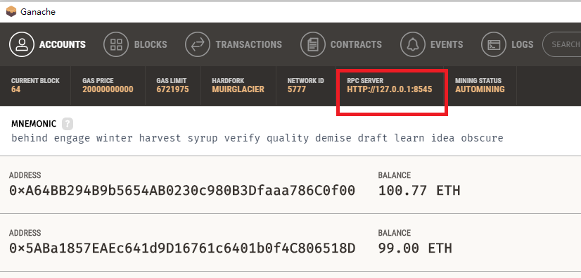
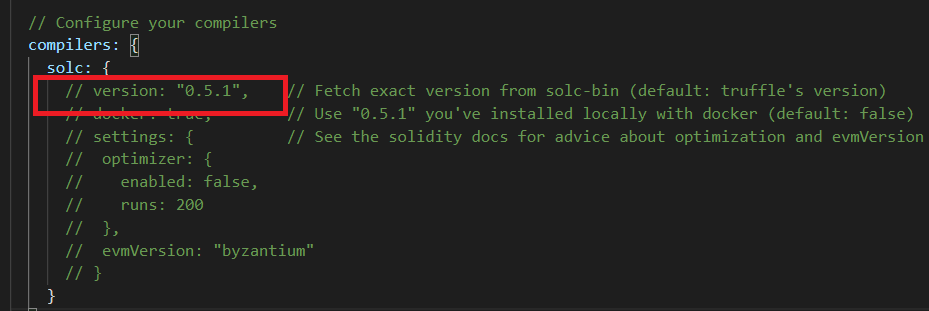
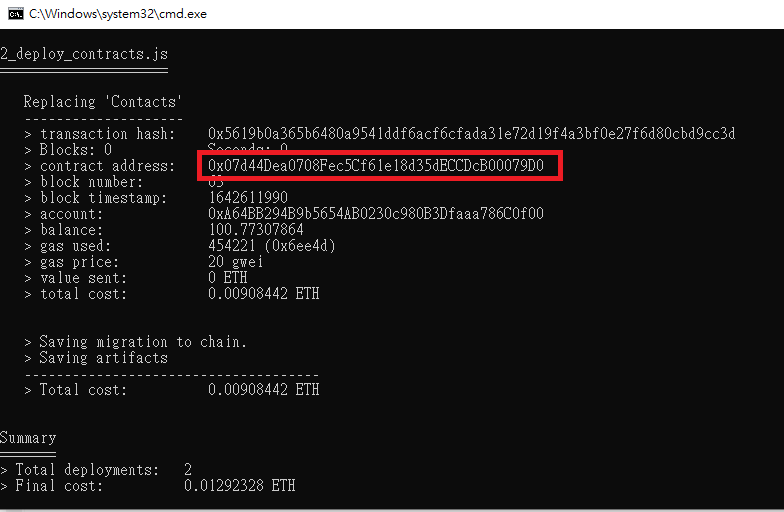
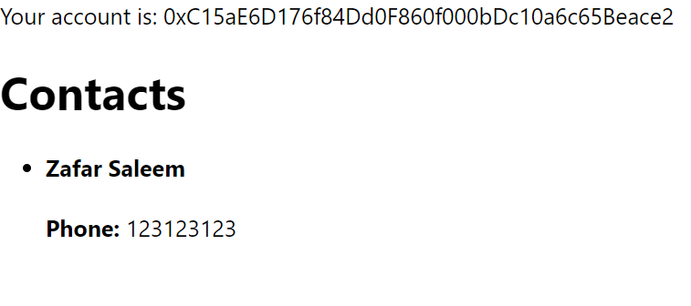

# **練習：讓 Contact 出現**

github: [https://github.com/Krypto-Camp/blockchain-tutorial](https://github.com/Krypto-Camp/blockchain-tutorial)

## 1.開啟 Ganache及設定 metamask

- 開啟 Ganache
- metamask 的網路需設定連至Ganache

## 2.前端 UI 處理

```
git clone https://github.com/Krypto-Camp/blockchain-tutorial.git
cd blockchain-tutorial/contacts
npm install
npm start     # 這個指令執行完會開啟測覽器, 同時 Terminal 會處於執行狀態,不要把這個Termianl 關掉, 否則測覽器會無法顯示內容
```

## 3.Contract 處理

VS  Code 開啟 blockchain-tutorial 資料夾

### 修改 truffle-config.js 設定

truffle-config.js 中將 developemnt: 區塊的註解符號拿掉

```
networks: {
    // Useful for testing. The `development` name is special - truffle uses it by default
    // if it's defined here and no other network is specified at the command line.
    // You should run a client (like ganache-cli, geth or parity) in a separate terminal
    // tab if you use this network and you must also set the `host`, `port` and `network_id`
    // options below to some value.
    //
    development: {
     host: "127.0.0.1",     // Localhost (default: none)
     port: 8545,            // Standard Ethereum port (default: none)
     network_id: "*",       // Any network (default: none)
    },

..........................
```

port 預設 8545 ，需依據Ganache 的 Port 調整，可參考Ganache 畫面 RPC SERVER 的設定值，HTTP 最後的數字為 Port



compilers 下的 version 設定可指定 solidity 版本，若要指定版本可取消註解並填入版本號碼




### 編譯、部署合約

Terminal 中將路徑移至 contracts 目錄，執行下列指令

```
truffle compile
truffle migrate
```

在 truffle migrate 執行結果中找 2_deploy_contracts.js 下的 contract address 項目，將後面的合約地址複製



若部署之後想要再次部署，migrations目錄中需增加新的 js，否則執行 truffle migrate 指令不會重新部署，此時可用 - - reset 參數重新部署

```
truffle migrate --reset
```

## 4.修改前端 UI 的程式

### 修改 config.js

- 將 CONTACT_ADDRESS 的值替換成剛才合約部署的地址
- 將 CONTACT_ABI 的內容替換成合約編譯後的 ABI，新的ABI檔案放在 contracts\build\contracts 目錄下的 Contacts.json
    
    (1). 開啟 contracts\build\contracts 目錄下的 Contacts.json ，複製 abi 項目中括符 [ ..... ] 包起來的內容
    
    ```
    "abi": [
    ......  從這一行開始複製  .........
    
        {
          "inputs": [],
          "payable": false,
          "stateMutability": "nonpayable",
          "type": "constructor"
        },
        {
          "constant": true,
          "inputs": [
            {
              "internalType": "uint256",
              "name": "",
              "type": "uint256"
            }
          ],
    
    	......................................
    
          "name": "createContact",
          "outputs": [],
          "payable": false,
          "stateMutability": "nonpayable",
          "type": "function"
        }
    
    	......  複製到這一行  .........
    
      ],
    "metadata": "{\"compiler\".....................,
    "bytecode": "0x6080604052600..................",
    ```
    
    (2). 將 config.js 的 CONTACT_ABI 項目的 [ ..... ] 的內容刪掉,然後貼上新ABI的內容
    
    ```
    export const CONTACT_ADDRESS = '0x07d44Dea0708Fec5Cf61e18d35dECCDcB00079D0'
    
    export const CONTACT_ABI = [
      // 這個地方貼上新的 ABI
    ];
    ```
    
    ## 5. 將瀏覽器內容更新，顯示新的內容
    
    